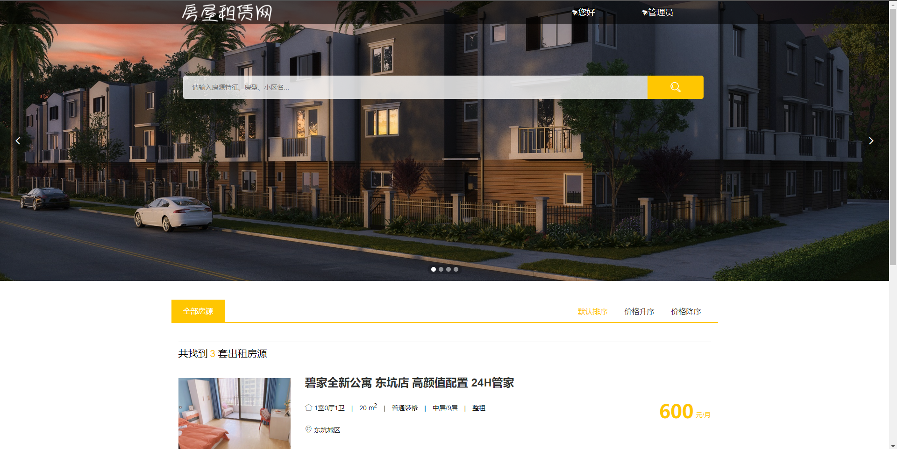
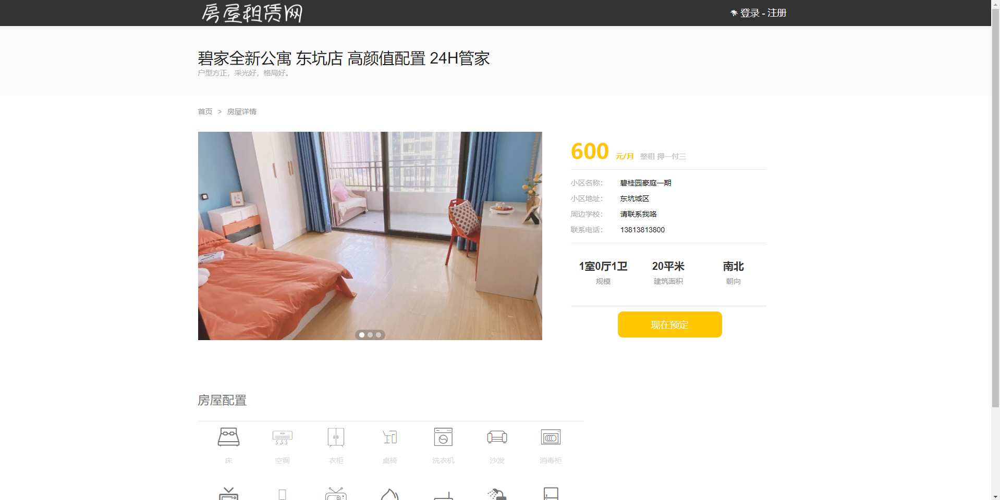
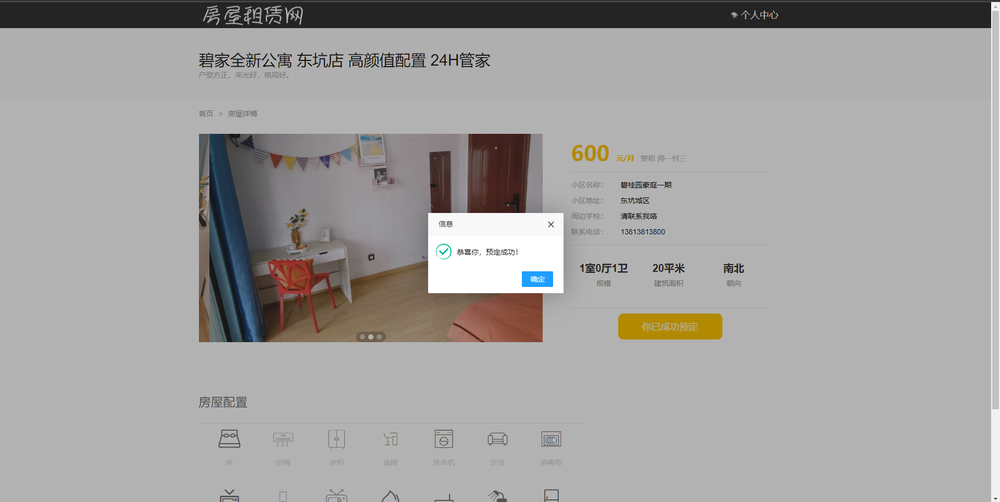
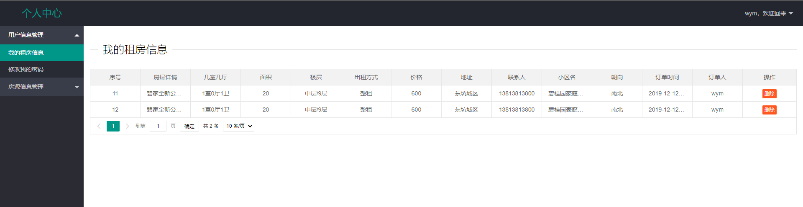
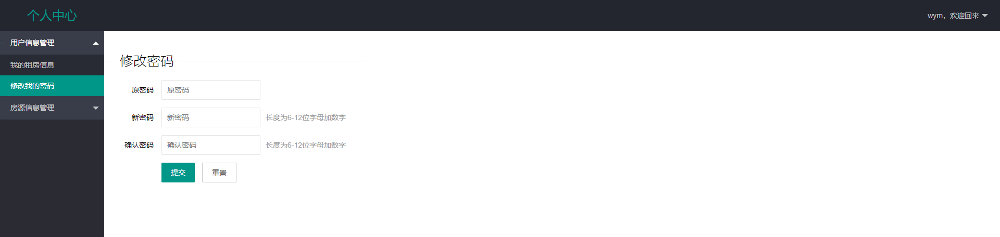
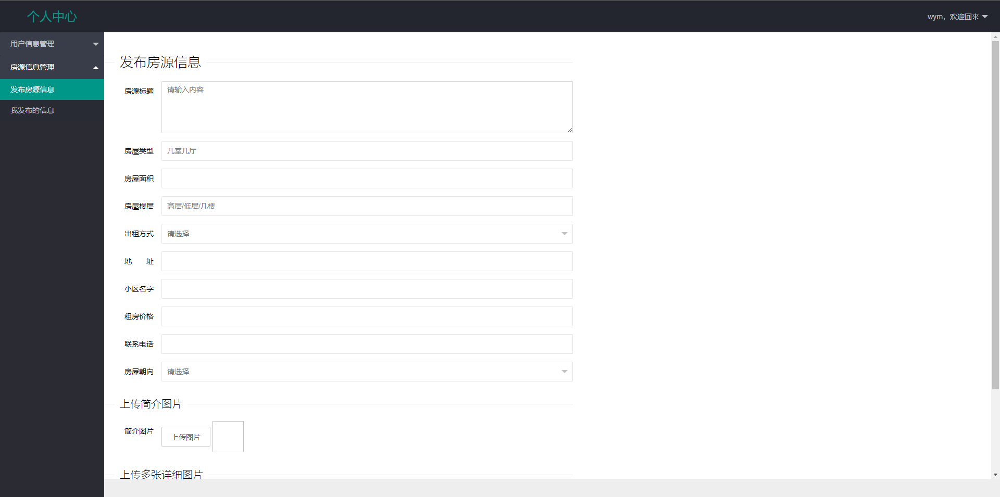
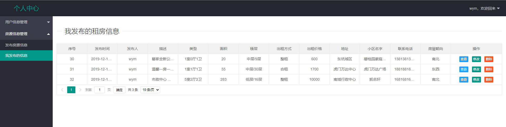
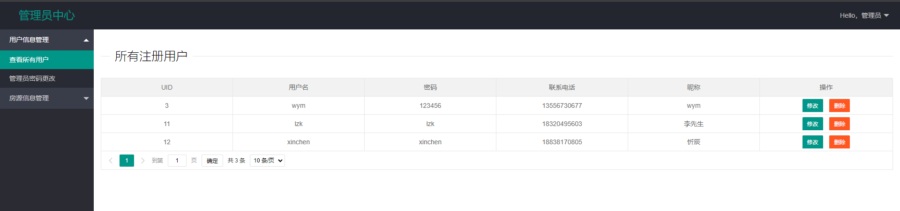
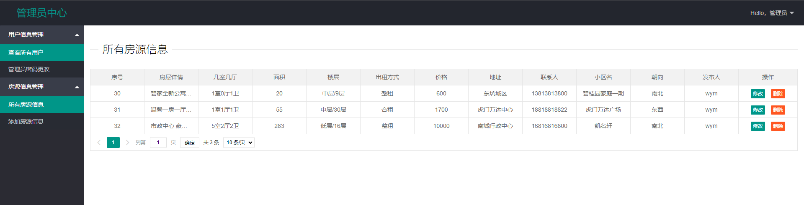

**完整代码收费 +   316595344     或    lz316595344  咨询** 

**接毕业设计和论文**

**如果图片加载不出来可以去博客看 https://blog.csdn.net/qq_56450993/article/details/133275432**

**毕业设计所有选题地址**

**[github]👉https://github.com/XinChennn/allProjects**

**[忻辰的个人博客]👉https://www.ixinjiu.cn/articles/156**

# 基于SpringBoot的房屋租赁系统

## 一、系统介绍

基于SpringBoot的房屋租赁系统，后端采用主流的Springboot框架进行开发，前端采用layui架构进行开发。

## 二、使用技术

后端技术栈：SpringBoot、Mybatis、Mysql

前端技术栈：LayUI、Jsp、css

## 三、环境介绍

基础环境 :IDEA/eclipse， JDK 1.8，Mysql8.0+，Maven

**所有项目以及源代码本人均调试运行无问题，可支持远程调试运行**

## 四、页面截图

## 五、浏览地址

  - 前台地址 http://localhost:8090/  账号： wym 密码： 123456
  - 后台地址(管理员登录) http://localhost:8090/toAdminLogin  账号： wym  密码：12345678

## 六、安装教程

1. 使用Navicat或者其它工具，在mysql中创建对应名称的数据库，然后运行项目的`resource`目录下的sql脚本（询问作者索取）；

2. 使用IDEA/Eclipse导入项目，若为maven项目请选择maven;导入成功后请执行maven clean;maven install命令，然后运行；

3. 修改 `application.yml` 里面的数据库配置

4. 启动项目后端项目

**需要完整代码 +   316595344     或    lz316595344  咨询**

**接毕业设计和论文**